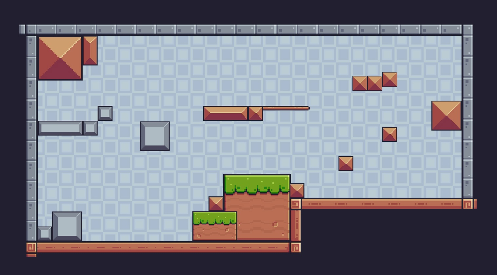

# Мир

Мир представляет собой множество платформ и коробок на которых игрок может стоять или бегать. 
На уровнях могут располагаться ловушки и собираемые предметы (фрукты или ключи).

[Геймплей](gameplay.md)

[Интерактивные объекты](interactiveObjects.md)

---

[Назад](../main.md)

[В главное меню](../../README.md)

© 2024, Разработчики приложения "Платформер".