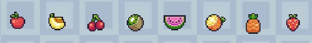
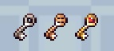

# Интерактивные объекты

Здесь представлен список всех объектов, с которыми можно взаимодействовать при прохождении уровня.

## Ловушки

  
  
- пила. Наносит игроку урон при соприкосновении.

## Собираемые предметы

  
  
- фрукты. Дают очки при сборе (Максимальное количество очков ограничено).

## Ключевые объекты

  
  
- финальная точка уровня. Открывается путем сбора 3-х ключей на уровне, при соприкосновении
    завершает уровень победой.

 

  
  
- ключи. Обязательный собираемый предмет, открывают финиш.

---

[Назад](../main.md)

[В главное меню](../../README.md)

© 2024, LohotronGames.