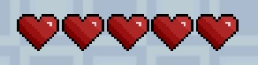
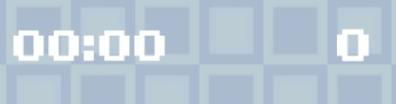
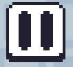
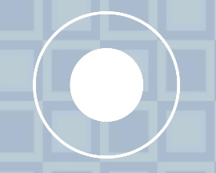
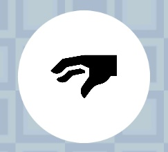

# Интерактивные объекты

Здесь представлен список всех объектов, с которыми можно взаимодействовать при прохождении уровня.

  
  
- здоровье игрока. Игрок погибнет, если потеряет все сердца.

 

  
  
- время (слева) и очки (справа). При прохождении уровня считается время прохождения, 
    на основании которого записываются рекорды. Очки можно получить за сбор фруктов.

 

  
  
- кнопка паузы. Приостанавливает игру, открывая меню паузы.

 

  
  
- джойстик. Позволяет управлять игроком при перемещении.

 

  
  
- кнопка подбора предметов. С её помощью можно собирать ключи.

---

[Назад](../main.md)

[В главное меню](../../README.md)

© 2024, LohotronGames.